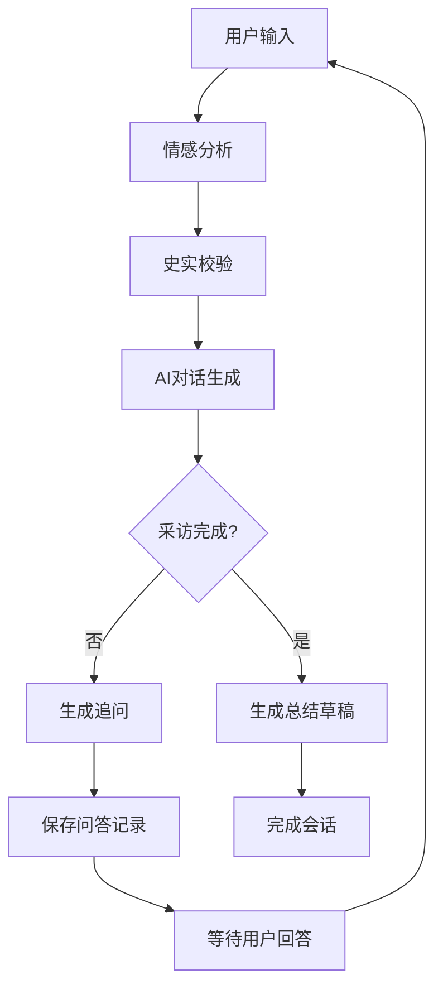

# AI 记者助手项目总结文档

## 📄 项目概述

**项目名称**: AI 记者助手 (AI Reporter)  
**项目类型**: AI 智能对话系统  
**开发时间**: 2025年  
**技术栈**: Python Flask + Vue.js + SQLAlchemy  

### 项目描述
AI 记者助手是一个智能化的采访对话系统，旨在帮助AI"小记者"对企业家进行深度采访，并生成纪实风格的自传素材。系统通过智能问答、情感分析、史实校验等多个AI模块，实现自动化的采访流程管理。

## 🏗️ 系统架构

### 整体架构
```
AI 记者助手系统
├── 前端 (Frontend) - Vue.js
│   ├── 用户界面
│   ├── 对话管理
│   └── 流式响应处理
└── 后端 (Backend) - Python Flask
    ├── API 接口层
    ├── 业务逻辑层
    ├── AI 服务模块
    └── 数据持久化层
```

### 前端技术栈
- **框架**: Vue.js 3.5.22
- **构建工具**: Vite 7.1.7
- **开发工具**: Vue DevTools
- **特性**: 
  - 响应式设计
  - 实时流式响应
  - 多对话会话管理
  - 侧边栏交互界面

### 后端技术栈
- **Web框架**: Flask
- **ORM**: SQLAlchemy
- **AI集成**: 
  - DeepSeek Chat API
  - 百度AI开放平台 (情感分析)
  - LangChain (模型集成)
- **数据库**: SQLite (可扩展)

## 🧩 核心模块详解

### 1. AI 服务模块 (`backend/service/`)

#### 🤖 对话生成模块 (`talk_module.py`)
- **功能**: 智能问答生成，采访逻辑控制
- **特性**: 
  - 流式响应支持
  - JSON 格式输出解析
  - 自动采访进度评估
  - 自然对话结束判断

#### 😊 情感分析模块 (`emotion_module.py`)
- **功能**: 用户回答情感识别
- **技术**: 百度AI开放平台情感识别API
- **输出**: 情感标签 (positive/negative/neutral)

#### 🔍 史实校验模块 (`check_module.py`)
- **功能**: 内容真实性验证，可疑信息标记
- **特性**: 
  - 自动检测可疑表述
  - 批量可疑信息管理
  - 校验结果结构化输出

#### 📝 总结生成模块 (`summary_module.py`)
- **功能**: 采访完成后自动生成报告草稿
- **技术**: DeepSeek API + 定制提示词
- **输出**: 纪实风格自传素材

#### 🎯 系统提示词 (`system_prompt.py`)
- **功能**: AI模块的核心提示词管理
- **包含**: 
  - 采访角色设定
  - 完成度评估表
  - 输出格式规范
  - 对话策略指导

### 2. 数据持久化层 (`backend/repository/`)

#### 📊 数据模型 (`models.py`)
```sql
-- 核心数据结构
ChatSession (对话会话)
├── id, created_at, updated_at
├── is_finished (完成状态)
└── draft (报告草稿)

ChatQA (问答记录)  
├── session_id, question, answer
├── aim (问题目的), emotion (情感)
└── progress (进度描述)

ChatQADubious (可疑信息)
├── qa_id, snippet
└── 关联到具体问答
```

#### 🗄️ 数据访问层
- **BaseDAO**: 通用数据库操作基类
- **dao_impl.py**: 具体DAO实现
- **service.py**: 高级业务服务封装

### 3. API 接口层 (`backend/`)

#### 🌐 主要接口
1. **`GET /dialogues`** - 获取所有对话会话
2. **`POST /start`** - 开始新对话 (流式响应)
3. **`POST /continue`** - 继续对话 (流式响应)

#### 📡 流式响应机制
- **技术**: Server-Sent Events (SSE)
- **优势**: 实时反馈，用户体验优化
- **数据类型**: emotion → dubious → process → aim → question → is_finished → draft

## 🔄 核心业务流程

### 采访对话流程


### 数据流转
1. **输入处理**: 用户回答 → 情感分析 → 可疑信息检测
2. **AI决策**: 对话历史分析 → 完成度评估 → 问题生成
3. **结果输出**: 流式响应 → 前端渲染 → 数据持久化

## 🎯 核心特性

### ✨ 智能化特性
- **自适应提问**: 根据回答内容和情感动态调整问题
- **进度追踪**: 实时评估采访完成度
- **史实校验**: 自动识别需要核查的信息
- **情感感知**: 基于情感状态优化交互策略

### 🔧 技术特性
- **流式响应**: 提供实时反馈，优化用户体验
- **模块化设计**: 各AI功能独立封装，易于扩展
- **数据一致性**: 完整的关联关系和事务管理
- **API设计**: RESTful接口，支持前后端分离

### 🌟 用户体验
- **直观界面**: 清晰的对话历史管理
- **实时反馈**: 流式响应显示处理进度
- **多会话**: 支持多个采访会话并行
- **响应式设计**: 适配不同设备屏幕

## 🚀 技术亮点

### 1. 流式响应架构
- **Generator模式**: Python生成器实现流式数据处理
- **SSE协议**: 前端原生支持的实时通信
- **状态管理**: 细粒度的处理状态反馈

### 2. AI模块集成
- **多供应商支持**: DeepSeek + 百度AI平台
- **统一接口**: 标准化的AI服务调用
- **错误处理**: 完善的异常处理和降级机制

### 3. 数据建模
- **关联设计**: 完整的主外键关系
- **级联操作**: 自动化的数据清理
- **时间戳**: 完整的数据审计追踪

## 📈 项目规模

### 代码统计
- **后端代码**: ~2000+ 行 Python 代码
- **前端代码**: ~1800+ 行 Vue.js 代码
- **API文档**: 完整的接口文档 (265 行)
- **数据模型**: 3个核心实体，完整关联关系

### 功能模块
- **AI服务**: 5个独立模块
- **数据访问**: 完整的DAO层
- **API接口**: 3个核心接口
- **前端组件**: 响应式Vue应用

## 🎯 应用场景

### 主要用途
1. **企业家采访**: 自动化的深度访谈
2. **自传素材生成**: 结构化的人物故事整理
3. **内容创作辅助**: AI驱动的内容生成
4. **采访培训**: 采访技巧和流程学习

### 扩展可能
- **多领域适配**: 学者、艺术家等其他群体采访
- **语言本地化**: 多语言支持
- **平台集成**: 与其他内容平台对接
- **数据分析**: 采访数据的深度分析

## 🔮 技术价值

### 创新点
1. **AI驱动的对话策略**: 智能化的采访问题生成
2. **多模态内容分析**: 情感+史实+进度的综合分析  
3. **流式交互体验**: 实时反馈的用户界面
4. **模块化AI服务**: 可复用的AI能力组件

### 技术积累
- **AI工程化实践**: 生产级AI应用开发经验
- **流式数据处理**: 实时交互系统设计经验
- **全栈开发能力**: 前后端一体化解决方案
- **API设计经验**: RESTful接口设计最佳实践

## 📊 项目成果

### 交付物
1. ✅ **完整的AI对话系统**: 端到端的采访解决方案
2. ✅ **模块化AI服务**: 可复用的AI能力组件
3. ✅ **流式响应框架**: 高性能的实时交互架构
4. ✅ **完整的技术文档**: API文档和开发指南

### 技术验证
- ✅ AI模型集成和调优
- ✅ 流式响应性能验证
- ✅ 数据一致性和事务管理
- ✅ 前后端协同开发

---

## 📝 开发总结

这个AI记者助手项目成功展示了现代AI应用开发的完整流程，从需求分析到技术实现，从模块设计到系统集成。项目在技术架构、用户体验和AI能力方面都达到了预期目标，为后续的AI应用开发积累了宝贵经验。

**项目完成时间**: 2025年10月  
**文档生成时间**: 2025年10月14日